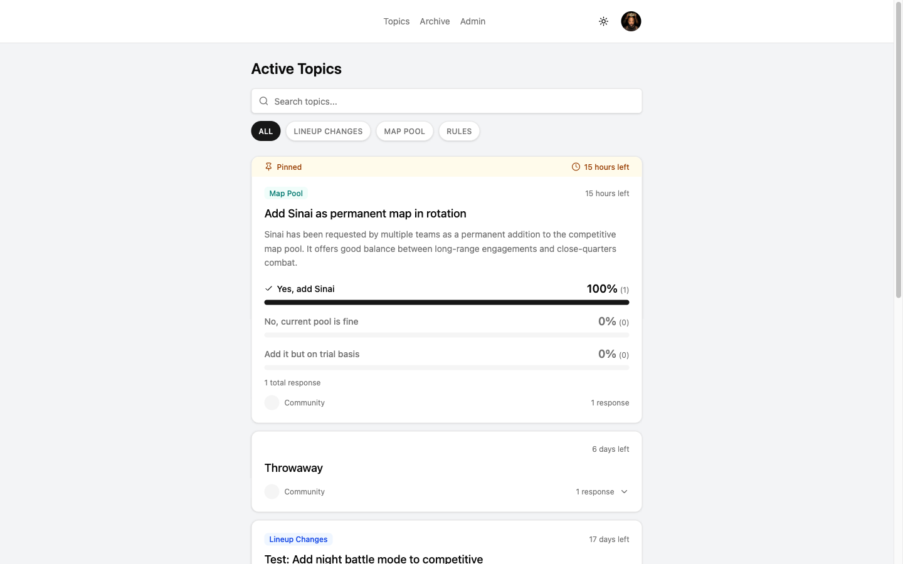
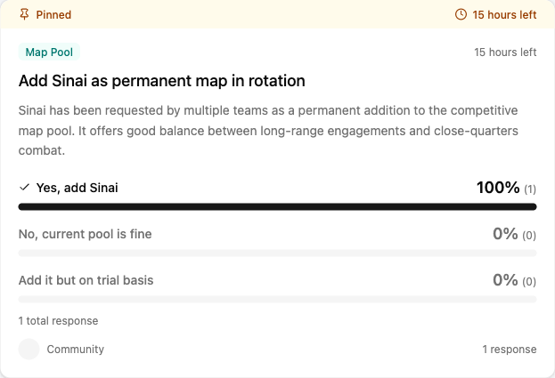
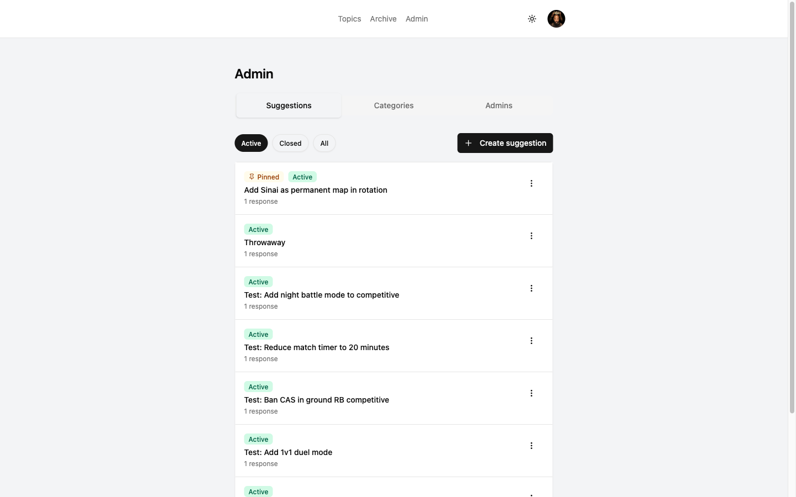
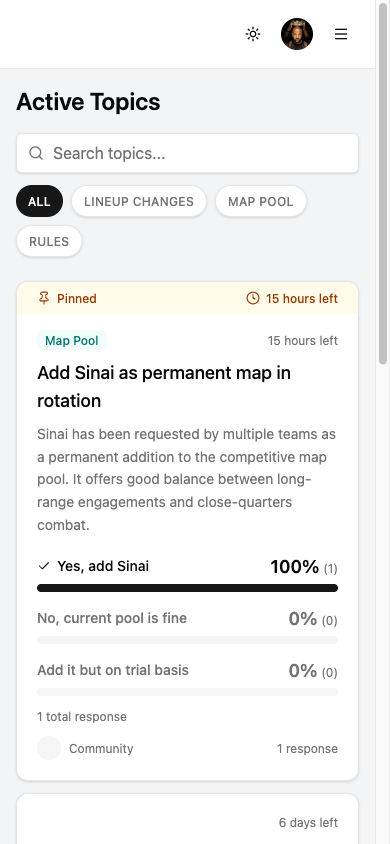

<p align="center">
  
</p>

<h1 align="center">WTCS Community Suggestions</h1>

<p align="center">
  Share opinions on competitive scene proposals with verified Discord identity.
</p>

<p align="center">
  <a href="https://github.com/Esk3tit/wtcs-community-polls/actions/workflows/ci.yml"></a>
  <a href="LICENSE"></a>
  <a href="https://polls.wtcsmapban.com"></a>
  
</p>

---

## Screenshots

| Topics list | Suggestion with results |
|-------------|-------------------------|
|  |  |

| Admin shell | Mobile view |
|-------------|-------------|
|  |  |

---

## What it is

WTCS Community Suggestions is a Discord-authenticated platform where the
War Thunder Competitive Scene community shares opinions on proposals — for
example, "Remove MiG-29 12-3 from this lineup" or "Change respawn point
positions for El Alamein."

This platform gathers community **opinions**, not binding votes. WTCS has
no direct authority over War Thunder's development — only Gaijin
Entertainment can implement game changes. What this tool does is collect
and present organized community feedback that WTCS admins can relay to
Gaijin.

**Core value:** one verified Discord account, one response, no
manipulation.

Hosted at [polls.wtcsmapban.com](https://polls.wtcsmapban.com) as a
sibling to the main WTCS Map Vote/Ban app.

---

## Tech stack

| Layer | Tool | Version |
|-------|------|---------|
| Language | TypeScript | 6.0.2 |
| UI | React | 19.2.4 |
| Router | TanStack Router | 1.168.10 |
| Build | Vite | 8.0.5 |
| Design | shadcn/ui + Tailwind CSS v4 | Maia / Neutral |
| Backend | Supabase (Postgres + Auth + Edge Functions + Storage) | JS client 2.101.1 |
| Hosting | Netlify (legacy free tier, Node 22) | — |
| Rate limiting | Upstash Redis (REST) | — |
| Errors | Sentry (`@sentry/react`) | 10.49.0 |
| Analytics | PostHog (`posthog-js`) | 1.369.3 |
| E2E | Playwright | 1.59.1 |
| Unit tests | Vitest + Testing Library | 4.1.2 |
| CI/CD | GitHub Actions (CI + EF deploy + cron) | — |
| Dependency hygiene | Dependabot + `npm ci` + pinned `esm.sh` | — |

All npm dependencies are pinned to exact versions (no `^` / `~` ranges).
Edge Function `esm.sh` imports are pinned to exact versions too. See the
upgrade-ritual section below.

Netlify build command (`netlify.toml`): `VITE_COMMIT_SHA=$COMMIT_REF npm ci && npm run build`.

---

## Local development

```bash
# 1. Install the Supabase CLI if you don't have it yet.
# https://supabase.com/docs/guides/cli/getting-started

# 2. Spin up the local Supabase stack (Postgres + Auth + Functions + Studio).
supabase start

# 3. Install deps (lockfile-strict).
npm ci

# 4. Copy `.env.example` to `.env` and fill in the values printed by `supabase start`
#    (VITE_SUPABASE_URL, VITE_SUPABASE_ANON_KEY). Leave VITE_SENTRY_DSN and
#    VITE_POSTHOG_KEY blank for local dev — Sentry/PostHog init is a no-op without keys.
cp .env.example .env

# 5. Run the dev server.
npm run dev
```

---

## Running tests

```bash
# Unit tests (Vitest + React Testing Library)
npm test

# Lint + type check (ESLint flat config with typescript-eslint)
npm run lint

# End-to-end smoke tests (Playwright against the preview build).
# Requires `supabase start` to be running; supabase start auto-applies
# supabase/seed.sql, then apply the additive E2E fixture seed:
# psql "$(supabase status --output json | jq -r '.DB.URL')" -f e2e/fixtures/seed.sql
npx playwright test --grep @smoke
```

CI runs the full suite on every PR. See `.github/workflows/ci.yml`.

---

## Deploying

The repo is wired for zero-friction continuous deployment:

- **Netlify (web app):** every push to `main` triggers a Netlify build +
  deploy to `polls.wtcsmapban.com`. Pull requests get a unique preview URL.
  Build runs on Node 22 (pinned in `netlify.toml`).
- **Supabase Edge Functions:** every push to `main` that touches
  `supabase/functions/**` triggers `.github/workflows/deploy-edge-functions.yml`,
  which runs `supabase functions deploy --use-api` for all 15 functions.
- **Cron sweep:** `.github/workflows/cron-sweep.yml` fires daily at
  `03:00 UTC`, invoking `close-expired-polls` via a secret-gated POST.
  The request sends both an `X-Cron-Secret: ${CLOSE_SWEEPER_SECRET}` header
  (the function's own auth gate) and an `Authorization: Bearer ${SUPABASE_ANON_KEY}`
  header to satisfy the Supabase Edge Function gateway's default
  `verify_jwt` check. This single invocation auto-closes expired
  suggestions AND keeps the Supabase free-tier project warm (well under
  the 7-day inactivity pause threshold).

First-time setup for a new environment: fill in every key listed in the
env-var table below, then trigger a deploy.

---

## Environment variables

Three scopes, three distinct stores — never mix them up. The canonical
contract lives in `.env.example`; this table mirrors it.

### Netlify (client build)

These are baked into the shipped JS bundle. `VITE_*` prefix is required.

| Key | Purpose |
|-----|---------|
| `VITE_SUPABASE_URL` | Public Supabase project URL |
| `VITE_SUPABASE_ANON_KEY` | Public anon key for the browser Supabase client |
| `VITE_SENTRY_DSN` | Public Sentry ingest URL |
| `VITE_POSTHOG_KEY` | Public PostHog project API key |
| `VITE_WTCS_GUILD_ID` | WT esports Discord server ID (client-side guild membership check) |
| `VITE_COMMIT_SHA` | Re-exported from Netlify's `$COMMIT_REF` in the build command (Netlify UI env vars don't expand `$COMMIT_REF`) |

### Netlify (build-time only, never shipped to browser)

No `VITE_` prefix — keeps these out of the client bundle. Consumed by
`@sentry/vite-plugin` during `npm run build` to upload sourcemaps.

| Key | Purpose |
|-----|---------|
| `SENTRY_ORG` | Sentry organization slug |
| `SENTRY_PROJECT` | Sentry project slug |
| `SENTRY_AUTH_TOKEN` | Sentry auth token (scopes: `project:releases` + `project:write`) |

### Supabase Edge Function runtime

Set via `supabase secrets set KEY=value --project-ref <ref>`.

| Key | Purpose |
|-----|---------|
| `CLOSE_SWEEPER_SECRET` | Gate for the `close-expired-polls` EF — only the GH Actions cron knows it |
| `UPSTASH_REDIS_REST_URL` | Upstash REST URL for rate limiting |
| `UPSTASH_REDIS_REST_TOKEN` | Upstash REST auth token |
| `DISCORD_GUILD_ID` | WT esports Discord server ID (server-side guild membership check) |

`SUPABASE_SERVICE_ROLE_KEY` is platform-provided at runtime — no manual action.

### GitHub Actions repo secrets

Set via GitHub repo Settings → Secrets and variables → Actions.

| Key | Purpose |
|-----|---------|
| `SUPABASE_ACCESS_TOKEN` | For `supabase functions deploy` |
| `SUPABASE_PROJECT_REF` | Project ref for the Supabase CLI |
| `SUPABASE_URL` | Full `https://<ref>.supabase.co` URL (used by cron workflow) |
| `SUPABASE_ANON_KEY` | Same public key as `VITE_SUPABASE_ANON_KEY`. Required by `cron-sweep.yml` as the `Authorization: Bearer` header — the Supabase EF gateway has `verify_jwt=true` by default |
| `CLOSE_SWEEPER_SECRET` | Same value as the Supabase secret above |

Local-development Supabase keys are deliberately NOT stored as GitHub
secrets — CI derives them at runtime from `supabase status --output json`
(they're deterministic fixed defaults and drift with the CLI, not with the
repo).

---

## Project structure

```
src/
  components/        React components (shadcn/ui + Tailwind v4)
    auth/            AuthGuard, AuthErrorPage
    layout/          Navbar, MobileNav
    suggestions/     SuggestionCard, SuggestionList, SuggestionForm, SuggestionSkeleton
    admin/           Admin shell (Tabs, CategoriesList, AdminsList, AdminSuggestionsTab)
    ui/              shadcn primitives (Button, Dialog, Input, etc.)
    AppErrorFallback.tsx
    ConsentChip.tsx
  contexts/          AuthContext (session + PostHog identify/reset)
  hooks/             useAuth, useSuggestions
  lib/               supabase client, posthog init, sentry replay loader, utils
  routes/            TanStack Router file-based routes
  assets/            wtcs-logo.png and other bundled assets
  __tests__/         Vitest + RTL unit tests

supabase/
  functions/         15 Deno Edge Functions (submit-vote, create-poll,
                     close-expired-polls, etc.) — all esm.sh imports pinned
  migrations/        SQL schema + RLS policies
  seed.sql           Admin seed + categories

e2e/
  playwright.config.ts
  helpers/auth.ts    Session injection helper (loginAs uses signInWithPassword)
  fixtures/          test-users.ts + seed.sql (bcrypt-hashed local fixture password)
  tests/             Four @smoke specs

.github/
  workflows/         ci.yml, deploy-edge-functions.yml, cron-sweep.yml
  dependabot.yml     Weekly grouped PRs (npm + github-actions)

docs/
  screenshots/       README images

public/              Static assets served as-is by Vite + Netlify
                     (_redirects, favicon.svg, icons.svg)
netlify.toml         Build command (Node 22) + security headers
```

---

## Contributing

This is a v1 community project. Scope is intentionally tight — see
`.planning/REQUIREMENTS.md` for the full requirement list and the
out-of-scope table.

**In-scope for v1:** Discord OAuth with 2FA + guild membership, admin
suggestion lifecycle, one-response-per-user with respondent-gated results,
admin-managed categories, pin/archive, mobile-first responsive UI,
observability (Sentry + PostHog) + supply-chain hardening (pinned deps +
Dependabot + `npm ci`).

**Out of scope (permanently or v2):** anonymous responses, comments,
email notifications, ranked-choice responses, user-created suggestions,
cross-app admin sync with the Map Vote app.

Issues and PRs welcome at <https://github.com/Esk3tit/wtcs-community-polls/issues>.

---

## Upgrade ritual for pinned dependencies

Every npm dep is pinned to an exact version. Every `esm.sh` import in
Edge Functions is pinned to an exact version. Two paths to upgrade:

### Automated (Dependabot)

Dependabot opens grouped weekly PRs every Monday (npm + `github-actions`
ecosystems). Review cadence:

1. Open the Dependabot PR.
2. Let CI run — if it passes, merge.
3. If CI fails, check the `npm audit` and test output for breaking
   changes. Pin to the prior known-good version if the upgrade is risky;
   otherwise fix forward in the same PR.

Dependabot's weekly commits also reset GitHub's 60-day inactivity clock,
which would otherwise auto-disable the scheduled cron workflow. This is
not coincidental — it's a load-bearing architectural property of the cron
keepalive story.

### Manual (ad-hoc bumps)

```bash
npm outdated                                    # see what's stale
npm install <package>@<version> --save-exact    # no `^` in the lockfile
npm run lint && npm test -- --run               # local gate
git commit -am "chore(deps): bump <package> to <version>"
```

### esm.sh imports are a separate trust anchor

Edge Functions import from `https://esm.sh/<package>@<exact-version>`.
Dependabot does NOT scan these — `esm.sh` has no lockfile equivalent, so
exact-version pinning is the only containment. To upgrade:

1. Browse `supabase/functions/**/index.ts` — find the current pinned
   version (e.g. `@supabase/supabase-js@2.101.1`).
2. Check the target version on npm: `npm view @supabase/supabase-js version`.
3. Update every occurrence in every EF (15 function directories plus
   `supabase/functions/_shared/*`).
4. Run `supabase start` + the e2e smoke suite to verify nothing broke.
5. Merge — `deploy-edge-functions.yml` fires on push-to-main.

Exact-version pinning shrinks the window for supply-chain tampering but
doesn't eliminate it. Migrating to `npm:` specifiers + a per-function
`deno.json` importmap is a viable next step if the attack surface ever
grows.

---

## License

[MIT License](LICENSE). Copyright (c) 2026 Khai Phan.
